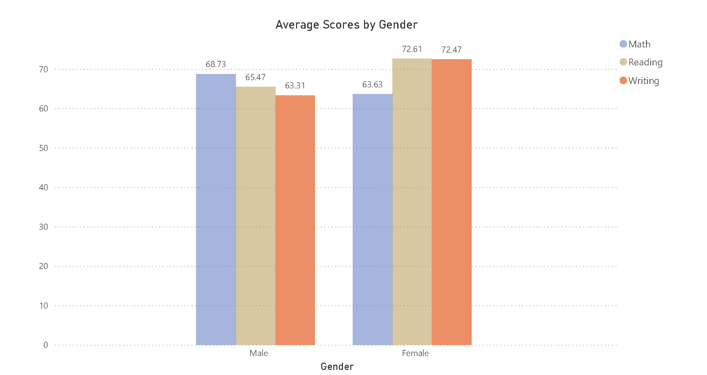
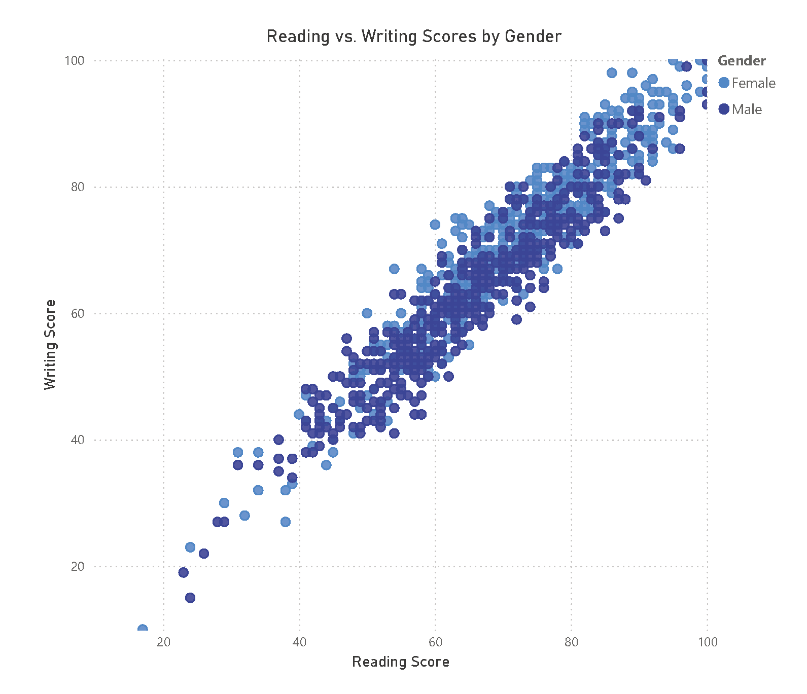
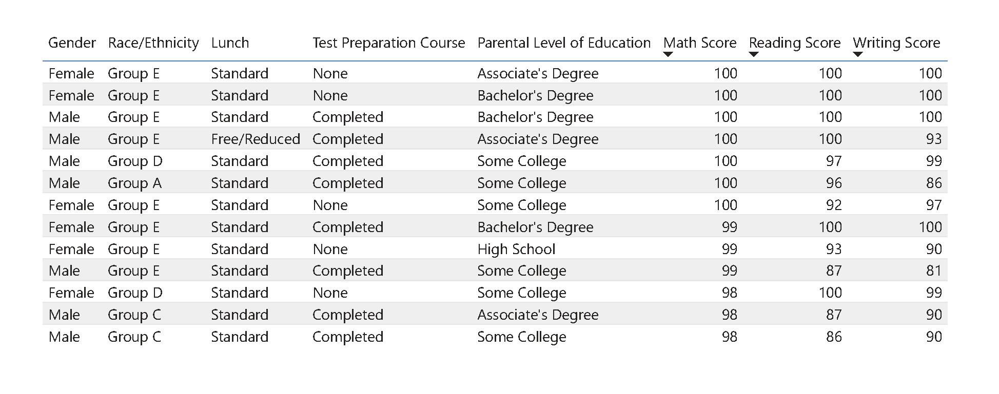

# Students Performance Analysis

## Project Overview
This project analyzes students' performance data using SQL and Power BI. 

## Data
- File: `Data/StudentsPerformance.csv`
- Columns:
  - `gender` (male/female)
  - `race_ethnicity` (group A, B, C, D, E)
  - `parental_level_of_education` (various categories)
  - `lunch` (standard/free_reduced)
  - `test_preparation_course` (none/completed)
  - `math_score`, `reading_score`, `writing_score` (numeric scores)

## SQL Analysis
All SQL scripts are in the `SQL/` folder:

1. `create_table.sql` — Creates the table structure.
2. `import_data.sql` — Imports the CSV data into PostgreSQL.
3. `queries.sql` — Contains analysis queries, including:
 - Displaying the first 10 records
 - Calculating average scores overall
 - Sorting students by math scores
 - Top 5 students by math score
 - Average math score by gender and test preparation course
 - Count of high math scorers by gender
 - Students failing in any subject (score < 50)

## Power BI Visualization
All Power BI work is in the `PowerBI/` folder:  

Visualizations include:
- Average Scores by Gender (Clustered Column Chart)
   - Displays average math, reading, and writing scores for male and female students.

  

- Reading vs. Writing Scores by Gender (Scatter Plot)
   - X-axis: Reading Score
   - Y-axis: Writing Score
   - Points colored by gender to show performance distribution.

   

- Top 3 Math Students (Table)
   - Shows all information for the top 3 students based on math scores.

   
